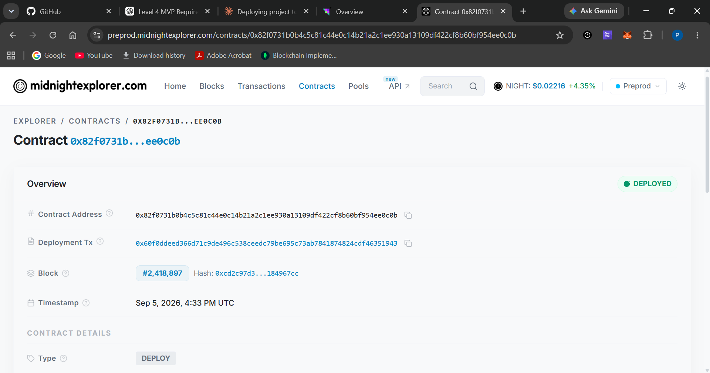

# CrediFi — Privacy-Preserving Loan Eligibility & Risk Verification on Midnight


🐦 **Follow the build:** https://x.com/CrediFiApp

CrediFi is a **Midnight Level 5 – Full Moon** project. It lets a user prove to a
lender that a *verified* financial credential satisfies a lending requirement —
**income ≥ minimumIncome** and **no previous default** — without ever revealing
the exact income or the private financial history.

> **Milestone: Midnight Level 5 – Full Moon.** The same CrediFi MVP from Level 4
> has been **extended and validated with real Preprod users** — see
> [Level 5 – Full Moon](#level-5-full-moon),
> [User Testing & Onboarding](#user-testing-onboarding), and
> [User Feedback](#user-feedback).

The eligibility evaluation runs entirely inside a **zero-knowledge circuit**.
Only the *outcome* (which requirements were satisfied and whether the user is
eligible) is written to the ledger. The exact income and the previous-default
flag are **witness-only** and never cross the private/public boundary.

> **Deployment status:** **DEPLOYED — LIVE on Midnight Preprod.** Contract:
> `82f0731b0b4c5c81c44e0c14b21a2c1ee930a13109df422cf8b60bf954ee0c0b`
> (finalized in block `2418897`). See
> [Preprod deployment](#preprod-deployment-contract-address) for the on-chain
> explorer link and details.

---

## Demo video

> ### ▶ CrediFi – Level 5 Full Moon Demo
>
> [▶ Watch the CrediFi – Level 5 Full Moon Demo](https://youtu.be/naV4jou_Ut0)
>
> *(Full walkthrough of the Level 5 CrediFi experience: 1AM Wallet connection on
> Midnight Preprod, eligibility verification, the Eligible / Not Eligible
> notification, the Eligibility Certificate, the Privacy Dashboard, and
> Verification History.)*

**Previous milestone demo (Level 4):**
[▶ Watch the Level 4 CrediFi Demo](https://youtu.be/Iemfqh_MUbs)
*(Superseded by the Level 5 demo above; kept for milestone history.)*

---

## Live demo

**The smart contract is live on Midnight Preprod** and readable on-chain:

- **Preprod explorer (deployed contract):**
  [View the deployed CrediFi contract on the Midnight Preprod explorer](https://preprod.midnightexplorer.com/contracts/82f0731b0b4c5c81c44e0c14b21a2c1ee930a13109df422cf8b60bf954ee0c0b)
- **Web app (runs against Preprod, wallet connection required):** the CrediFi
  frontend is run locally in the browser and connects to a real Midnight
  **Preprod** wallet through the DApp Connector:

  ```bash
  npm install
  npm run contract:compile
  npm run frontend:dev      # http://localhost:5173
  ```

See [Getting started](#getting-started) for the full command list and
[Preprod deployment & contract address](#preprod-deployment-contract-address)
for the deployment record.

---

## Level 5 – Full Moon

**Midnight Level 5 – Full Moon** extends the Level 4 CrediFi MVP rather than
replacing it. The core guarantee is unchanged and still the centre of the
project: a user proves **income ≥ minimumIncome** and **no previous default** to
a lender **without revealing the exact income or the private financial
history**, because the evaluation runs inside a zero-knowledge circuit and only
the binary outcome reaches the ledger.

What changed for Level 5:

- **The same MVP was put in front of 56 testers** during the Level 5 feedback
  round. The collected responses document wallet setup, connection,
  verification-flow usability, privacy understanding, and overall experience.
- **The product surface was rebuilt around that feedback** — a full Dashboard
  with dedicated Privacy, History, Lender and Certificate views, direct page
  navigation instead of anchor scrolling, explicit Eligible / Not Eligible
  notifications, and accessibility improvements. See
  [Updated Level 5 Features](#updated-level-5-features).
- **Wallet onboarding was made explicit** with 1AM Wallet on Preprod, documented
  end to end in [User Testing & Onboarding](#user-testing-onboarding).
- **Feedback was collected systematically** through a Google Form and published
  as evidence in a Google Sheet — see [User Feedback](#user-feedback).
- **Documentation was brought up to date** with the delivered Level 5 build and
  its test suite.

Submission status is tracked in the
[Level 5 Submission Checklist](#level-5-submission-checklist).

---

## Updated Level 5 Features

All of the following are implemented in the current build.

| Feature | Where |
| --- | --- |
| **Direct page navigation** — nav/footer items are real buttons that switch views directly; no anchor (`href="#…"`) or `scrollIntoView` navigation remains | `frontend/src/App.tsx`, `frontend/src/lib/navigation.ts`, `frontend/src/components/Navbar.tsx` |
| **Dashboard** — overview with wallet / eligibility / verification / network stat cards, verification status, privacy status and recent activity | `frontend/src/components/Dashboard.tsx`, `DashboardTabs.tsx` |
| **Eligibility verification** — the real compiled Compact contract is executed in-process and the result is read back out of contract state (never mocked) | `frontend/src/engine.ts` |
| **Eligible / Not Eligible notifications** — a live-region toast on every result, with distinct success / error messaging | `frontend/src/lib/navigation.ts` (`resultNotification`), `components/Notification.tsx` |
| **Verification History** — every verification recorded this session, with requirement, result, status and expandable technical details | `frontend/src/components/VerificationHistory.tsx` |
| **Eligibility Certificate** — a printable / save-as-PDF certificate summarising the requirement, outcome, lender reference, result id and holder hash | `frontend/src/components/EligibilityCertificate.tsx` |
| **Privacy Dashboard** — a side-by-side "never shared" vs "can be verified" view of exactly what leaves the private boundary | `frontend/src/components/PrivacyDashboard.tsx` |
| **Wallet connection** — real Midnight **DApp Connector** (CAIP-372) integration; connectors are discovered by enumeration, so 1AM Wallet and Lace both work, with network and rejection handling | `frontend/src/wallet.ts`, `components/WalletStatus.tsx` |
| **Responsive, user-friendly UI** — hand-written CSS with breakpoints at 980px / 760px / 420px, a mobile navigation menu, dark-mode support and touch press feedback | `frontend/src/styles.css` |
| **Accessibility improvements** — `aria-live` result announcements, `role="status"` / `role="alert"` regions, `aria-current` / `aria-pressed` state on nav and tabs, labelled landmarks and lists, decorative glyphs hidden from assistive tech, visible `:focus-visible` rings and `prefers-reduced-motion` support | `components/Notification.tsx`, `Navbar.tsx`, `DashboardTabs.tsx`, `ProgressSteps.tsx`, `styles.css` |

---

## User Testing & Onboarding

The Level 5 test round was run with real users against Midnight **Preprod**.
The intended onboarding path is:

### 1. Install 1AM Wallet

- Official site: <https://1am.xyz/>
- Chrome Web Store:
  [1AM Wallet](https://chromewebstore.google.com/detail/1am/bphnkdkcnfhompoegfpgnkidcjfbojjp)

### 2. Switch the wallet to Midnight Preprod

1AM Wallet must be pointed at the **Midnight Preprod** network before CrediFi
can be used. CrediFi requests the Preprod network id (`NETWORK_ID` in
`frontend/src/config.ts`) and shows a `wrong-network` error if the wallet is on
any other network, so testers are guided to Preprod up front.

### 3. Run the CrediFi app

```bash
npm install
npm run contract:compile
npm run frontend:dev      # http://localhost:5173
```

### 4. Connect the wallet

Press **Connect wallet** in the app. CrediFi discovers the injected connector
on `window.midnight` by enumeration (CAIP-372), so the 1AM Wallet connector is
picked up automatically — no wallet-specific hardcoding. The 1AM Wallet approval
popup then authorises the connection, and the app reads the genuine wallet
address (shielded address when available).

Users may decline the request; the app surfaces a `rejected` state and never
fabricates an address. A mocked connector exists **only** inside the automated
test environment (`frontend/src/test/App.test.tsx`) and is never used in the
browser flow.

### 5. Test CrediFi eligibility verification

Once connected, the tester supplies a financial credential and a lender
requirement (**minimum income** + **no prior default**), and runs the
verification. The result is produced by the real compiled circuit, followed by
an **Eligible** or **Not Eligible** notification. The tester can then open the
Dashboard to review the Privacy Dashboard, the Verification History entry, and
the Eligibility Certificate for that result.

### 6. Complete the user feedback form

Finally, testers completed the structured user feedback form covering
onboarding clarity, wallet setup, the verification flow and overall usability.
Responses are collected and published as evidence in
[User Feedback](#user-feedback).

---

## User Feedback

Structured user feedback was collected from the Level 5 Preprod test round.
**The response data is now mirrored in this repository**, so a reviewer can
verify the participant count without leaving the repo.

| Evidence | Where |
| --- | --- |
| **Repository evidence — the 56 wallet addresses, timestamps and format audit** | [`USERS.md`](./USERS.md) |
| **Repository evidence — what testers said, the counts, and what changed** | [`docs/FEEDBACK.md`](./docs/FEEDBACK.md) |
| **Repository evidence — how to actually run and test the app** | [`docs/USAGE.md`](./docs/USAGE.md) |
| **External source of truth — the response sheet** | [CrediFi – Level 5 user feedback (Google Sheet)](https://docs.google.com/spreadsheets/d/1yYpRJhoTLcjaDhWp4KIBGeo7d0WnhsDOUtQmGLtmjI8/edit?usp=sharing) |
| **External wallet check — Subscan (aggregate only)** | [`USERS.md` § Wallet verification](./USERS.md#wallet-verification-subscan) |

- **Collection method:** a **Google Form** covering onboarding, 1AM Wallet
  setup, the Preprod network, wallet connection, the eligibility verification
  flow, and overall usability.
- **Participants:** **56 responses**, containing **56 unique wallet addresses**
  and **56 unique submitter emails**, with **0 blank rows**, tested between
  2026-09-15 and 2026-09-29. This exceeds the Level 5 requirement of 50 user
  wallet addresses. Source of truth: the response export
  `(Responses) (2).xlsx`. Three older snapshots of the same form exist; they
  were reconciled against it and none of their numbers are used — see
  [`USERS.md` § Data provenance](./USERS.md#data-provenance-and-limitations).
- **Wallet check:** the team ran a **manual Subscan check** of those 56 unique
  addresses against **Midnight Preprod Subscan**. The result was recorded as a
  tally: **53 found, 3 not found**.

### Read the numbers honestly

- **This is not a claim of 56 on-chain verified users.** It is one manual
  Subscan check, recorded as a **53/3 aggregate tally**.
- **No individual address is marked verified or unverified.** The per-address
  output of the check does not exist in this repository, so the **3 unmatched
  addresses are intentionally left unidentified** — they were not inferred from
  address formatting, row order, or older exports. See
  [`USERS.md` § Wallet verification](./USERS.md#wallet-verification-subscan).
- Being found on Subscan means the address is **indexed by the explorer**. It
  does **not** prove the person ran the CrediFi application, and **no
  transaction or activity evidence** is claimed anywhere in this repository.
- **52 of 56** addresses match the `mn_addr_preprod1…` string shape and **4 do
  not** (2 carry no Preprod prefix, 1 is truncated, 1 is free text). This is a
  **format observation only** — it is never used as a verification signal, and
  is not cross-referenced against the 53/3 tally.
- **No feature in this repository was implemented *because of* this feedback.**
  The Level 5 product rebuild (`c32d06f`, 2026-09-15 04:15 UTC) landed *before*
  the first response (2026-09-15 12:04), and the only post-feedback commit
  (`afd8640`) touches `README.md` only. See
  [`docs/FEEDBACK.md` § What We Changed](./docs/FEEDBACK.md#what-we-changed).

> The individual free-text responses stay in the linked Google Sheet as the
> source of truth. The wallet addresses, timestamps and derived statistics are
> mirrored in [`USERS.md`](./USERS.md) / [`docs/FEEDBACK.md`](./docs/FEEDBACK.md)
> so the participant count is verifiable in-repo.

---

## Problem statement

Lending decisions depend on sensitive financial facts — income, credit history,
and whether an applicant has previously defaulted. Sharing this data directly
with a lender is invasive and creates large attack surface: the very facts a
user needs to keep private are the ones a lender asks for.

CrediFi addresses the question: *how can a lender verify loan eligibility and
risk without the applicant having to reveal their exact income or private
financial history?*

Borrowers deserve mainstream financial services — access to credit — without
surrendering their most sensitive data to every lender they apply to.

## Solution

CrediFi lets an applicant prove to a lender that a **verified** financial
credential satisfies a lending requirement using a **zero-knowledge proof** on
the Midnight Network. The evaluation (income ≥ threshold, no prior default) runs
entirely **inside the ZK circuit** on private witnesses. The lender can verify
with confidence that the signed credential came from a trusted issuer and meets
the criteria, while the applicant reveals **only** a yes/no eligibility summary.

- Built in [Compact](https://docs.midnight.network/compact), Midnight's
  privacy-preserving smart-contract language.
- Credentials are signed by a trusted issuer with Schnorr signatures over
  Jubjub and verified in-circuit (tamper-evident + non-replayable).
- Only binary outcome flags are written to the ledger; the exact income and
  default flag never cross the private/public boundary.

---

## Highlights

- **Private-by-design contract** written in [Compact](https://docs.midnight.network/compact),
  verified by 30 contract tests proving both the eligibility matrix **and** that
  witness inputs stay off-ledger.
- **Schnorr attestations over Jubjub** signed by a deterministic mock credential
  issuer and verified **inside the ZK circuit** (`schnorr.compact`).
- **Tamper-evident binding**: each credential is cryptographically bound to the
  holder's derived identity, so signatures cannot be replayed or reused.
- **Admin-guarded governance**: only the contract admin can register/remove
  trusted issuers (enforced in-circuit).
- **Demo web app** that runs the **official compiled contract** in-process to
  produce genuine results — no fabricated outcomes.
- **CI/CD** (.github/workflows) that compiles the contract, regenerates ZK
  bindings, and runs all tests/builds on every push.

---

## Tech stack

- **Smart contract:** [Compact](https://docs.midnight.network/compact)
  (`credifi.compact` + `schnorr.compact`), compiled to ZK IR with the Compact
  devtools (0.31.1).
- **Contract SDK:** `@midnight-ntwrk/compact-runtime`,
  `midnight-js-contracts`, `wallet-sdk` — wired to the Midnight Preprod indexer
  and RPC.
- **Cryptography:** Schnorr signatures over Jubjub, verified in-circuit.
- **Backend runtime:** Node.js ≥ 22, TypeScript.
- **Frontend:** React + Vite web app running the compiled contract in-process,
  with a tabbed Dashboard, Eligibility Certificate, Privacy Dashboard and
  Verification History.
- **Wallet:** Midnight **DApp Connector** (`@midnight-ntwrk/dapp-connector-api`,
  CAIP-372) — connectors are discovered by enumeration, so
  [1AM Wallet](https://1am.xyz/) and Lace both work.
- **CI/CD:** GitHub Actions (`.github/workflows/ci.yml`).

---

## Repository layout

```
.
├── package.json               # npm workspaces + top-level scripts
├── contract/                  # Midnight smart contract (Compact)
│   ├── src/
│   │   ├── credifi.compact    # main CrediFi contract
│   │   ├── schnorr.compact    # Schnorr verification module
│   │   ├── witnesses.ts       # private-state witnesses
│   │   ├── mock-issuer.ts     # deterministic mock credential issuer
│   │   ├── config.ts          # Preprod runtime config
│   │   ├── deploy.ts          # honest deploy/verify preflight CLI
│   │   └── test/              # eligibility, privacy, wallet-state + sync-mode tests
│   └── tsconfig*.json
├── frontend/                  # React + Vite web app
│   └── src/
│       ├── engine.ts          # runs the compiled contract in-process
│       ├── wallet.ts          # real Midnight DApp Connector (CAIP-372) connectivity
│       ├── App.tsx            # state-based routing + top-level app state
│       ├── config.ts          # Preprod network id + contract address
│       ├── lib/               # navigation, eligibility + formatting helpers
│       ├── components/        # dashboard, certificate, privacy, history, nav, toasts
│       ├── styles.css         # design system, responsive + a11y rules
│       └── test/              # engine, navigation, navbar, dashboard + app tests
├── docs/                      # setup, architecture, deployment, Level 5 evidence
│   ├── FEEDBACK.md            # Level 5 user feedback: heard, counted, and what changed
│   └── USAGE.md               # how to run and test the MVP on Preprod
├── USERS.md                   # Level 5 test users + wallet evidence (56 responses)
├── screenshots/               # Preprod deployment evidence
└── .github/workflows/ci.yml   # CI pipeline
```

> `contract/src/managed/` holds automatically generated Compact bindings and ZK
> artifacts and is **git-ignored** — regenerate with `npm run contract:compile`.

---

## Prerequisites

- **Node.js ≥ 22** and npm
- The **Compact devtools + compiler** (see [Installation](https://docs.midnight.network/getting-started/installation)):
  ```bash
  curl --proto '=https' --tlsv1.2 -LsSf https://github.com/midnightntwrk/compact/releases/latest/download/compact-installer.sh | sh
  compact update 0.31.1   # match the contract language version
  ```
- For **on-chain** deployment only: a running proof server (Docker +
  `midnight_bn254`) and a funded Preprod wallet.

---

## Getting started

```bash
# 1. Install workspace dependencies
npm install

# 2. Compile the Compact contract (regenerates managed bindings + zkir)
npm run contract:compile

# 3. Run the contract tests (30 tests: eligibility, privacy, wallet state, sync mode)
npm run contract:test

# 4. Build both packages
npm run build

# 5. Run the frontend test suite (59 tests: engine, navigation, dashboard, app)
npm run frontend:test

# 6. Start the demo web app
npm run frontend:dev
```

### Top-level scripts

| Script                   | Description                                          |
| ------------------------ | ---------------------------------------------------- |
| `npm run contract:compile` | Compile `contract.compact` into `src/managed`      |
| `npm run contract:test`    | Run the contract unit tests                        |
| `npm run contract:build`   | Build the contract package (tsc + copies artifacts) |
| `npm run frontend:test`    | Run the frontend engine + app tests                |
| `npm run frontend:build`   | Build the web app for production                   |
| `npm run build`            | Build both packages                                |
| `npm run deploy`           | Preflight for Preprod deployment (readiness report) |
| `npm run verify`           | Preflight + deploy-status report                   |

---

## How the privacy works

1. A trusted credential issuer signs the user's financial data
   (`monthlyIncome`, `previousDefault`, `holderHash`) with a Schnorr signature
   over Midnight's native Jubjub curve.
2. The user connects a wallet, supplies their (private) credential, and requests
   verification against a lender-defined requirement.
3. Inside the Midnight ZK circuit, CrediFi checks the issuer is registered and
   the signature is valid, then evaluates **income ≥ minimumIncome** and the
   no-default requirement — all on **private witnesses**.
4. Only the **binary eligibility summary** (boolean flags + the lender's own
   threshold) is disclosed and stored in the ledger, keyed by the holder's
   derived, unlinkable identity hash.

A user's exact income is never serialized into any ledger field, result record,
or proof. This is enforced and proven by the contract privacy tests.

---

## Documentation

**Level 5 evidence (in this repository):**

- [`USERS.md`](./USERS.md) — the **56 test users**, their wallet addresses,
  timestamps, address-format audit and the Subscan verification boundary
- [`docs/FEEDBACK.md`](./docs/FEEDBACK.md) — **what testers said**, the
  quantitative summary, user-requested improvements, what changed, the
  commit evidence, and the limitations
- [`docs/USAGE.md`](./docs/USAGE.md) — **how to run and test the MVP on Preprod**,
  including troubleshooting, known limitations, and where the code and this
  README disagree

**Project documentation:**

- [Setup guide](./docs/setup.md) — detailed environment setup
- [Architecture](./docs/architecture.md) — contract, witnesses, engine design
- [MVP scope](./docs/mvp-scope.md) — the five attestation approaches delivered
- [Deployment (Preprod)](./docs/deploy-onchain.md) — how a real on-chain
  deployment is performed (proof-server prerequisites, wallet, wiring)

**External evidence:**

- [Level 5 user feedback — Google Sheet](https://docs.google.com/spreadsheets/d/1yYpRJhoTLcjaDhWp4KIBGeo7d0WnhsDOUtQmGLtmjI8/edit?usp=sharing)
  — the response source of truth behind `USERS.md` and `docs/FEEDBACK.md`
- [▶ CrediFi – Level 5 Full Moon Demo](https://youtu.be/naV4jou_Ut0) — recorded walkthrough
- [Deployed contract on the Midnight Preprod explorer](https://preprod.midnightexplorer.com/contracts/82f0731b0b4c5c81c44e0c14b21a2c1ee930a13109df422cf8b60bf954ee0c0b)

---

## Roadmap / deferred

- ~~**Real on-chain deployment** on Preprod~~ — **DONE:** contract live on
  Preprod at `82f0731b0b4c5c81c44e0c14b21a2c1ee930a13109df422cf8b60bf954ee0c0b`;
  `CONTRACT_ADDRESS` is set in the configs (see
  [Preprod deployment](#preprod-deployment-contract-address)).
- ~~**Browser wallet integration**~~ — **DONE for Level 5:** the app connects to
  a real Midnight wallet through the DApp Connector, tested with
  [1AM Wallet](https://1am.xyz/) on Preprod (see
  [User Testing & Onboarding](#user-testing-onboarding)). Still deferred:
  submitting the verification itself as an on-chain transaction from the browser,
  rather than executing the compiled contract in-process.
- Persistent verification history across sessions (currently in-memory for the
  active session only).
- Issuer runs as a trusted **backend service** (the mock issuer's deterministic
  secret is simulation-only and must never live in client code).

---

## Testing

The core guarantees — correctness **and** privacy — are verified continuously.
**89 tests** in total: 30 contract + 59 frontend.

- **Contract tests (30)** in `contract/src/test/`:
  - `eligibility.test.ts` (14) — the full eligibility matrix, multi-lender
    records, issuer authentication, and admin governance.
  - `privacy.test.ts` (3) — proves the exact income, default flag, and signature
    material never appear in any serialized public state, and that distinct
    users are keyed by 32-byte identity hashes.
  - `wallet-state.test.ts` (8) — wallet state handling and persistence.
  - `sync-mode.test.ts` (5) — the safe wallet sync mode.
- **Frontend tests (59)** in `frontend/src/test/`:
  - `engine.test.ts` (7) — re-run the same matrix through the actual compiled
    contract in a node environment (needed because the WASM runtime does not run
    inside jsdom), plus a privacy guarantee on the returned outcome shape.
  - `navigation.test.ts` (11) — direct view/tab opening for every nav target in
    both connected and disconnected states, plus the Eligible / Not Eligible
    notification payloads (including a check that no income figure leaks into
    the notification text).
  - `dashboard-components.test.tsx` (11) — the Dashboard, DashboardTabs, Privacy
    Dashboard, Verification History, Risk score, Lender Portal, Eligibility
    Certificate and Profile sections render correctly.
  - `navbar.test.tsx` (4) — all nav labels present, **no `href="#"` anchor
    navigation**, and every nav control is a `type="button"` button.
  - `eligibility.test.ts` (8) — risk-category derivation and the satisfied / unmet
    requirement labels.
  - `App.test.tsx` (18) — end-to-end app behaviour: direct page navigation,
    real DApp Connector connection (approval, rejection, not-detected,
    wrong-network, shielded→unshielded address fallback, connector enumeration)
    and the end-to-end Eligible / Not Eligible notifications.

```bash
npm run contract:test   # 30 tests
npm run frontend:test   # 59 tests
```


## CI/CD

A GitHub Actions workflow (`.github/workflows/ci.yml`) runs on every push to
`main` and pull request:

[](https://github.com/poojakohinkar06-creator/credifi-midnight-level4/actions/workflows/ci.yml)

1. Installs the pinned Compact devtools + compiler (0.31.1).
2. `npm ci`, then compiles the Compact contract to regenerate the managed
   bindings and zkir artifacts.
3. Runs contract typecheck / test / build.
4. Runs frontend typecheck / build / test.

This mirrors the validated local toolchain so every change is verified against
real compiled contract artifacts.

## Running the app locally

Run the local, in-browser app of the official compiled contract:

```bash
npm run frontend:dev   # http://localhost:5173
```

The app guides you through **connect wallet → financial credential → lender
requirement → outcome**, computing genuine eligibility results from the real
compiled circuit (the exact income stays witness-only). After a result you get an
**Eligible / Not Eligible** notification and a full **Dashboard** with the
**Privacy Dashboard**, the **Verification History** entry, and the printable
**Eligibility Certificate**.

See [▶ CrediFi – Level 5 Full Moon Demo](https://youtu.be/naV4jou_Ut0) for the
recorded walkthrough, and [Live demo](#live-demo) for how to run it against a
Preprod wallet.

## Repository

- **GitHub:** <https://github.com/poojakohinkar06-creator/credifi-midnight-level4>
- **Default branch:** `main`
- **CI:** GitHub Actions on every push and pull request
  ([`ci.yml`](https://github.com/poojakohinkar06-creator/credifi-midnight-level4/actions/workflows/ci.yml))
- **History:** **28 commits** (`git rev-list --count HEAD`), spanning the
  contract, the zero-knowledge privacy tests, the web app, wallet integration,
  and the Level 5 product and documentation work — i.e. well over the 20
  meaningful commits expected for this milestone. Verify with:

  ```bash
  git rev-list --count HEAD   # -> 28
  git log --oneline --decorate
  ```

  The per-commit breakdown (code / tests / docs / scaffolding) is in
  [`docs/FEEDBACK.md` § Commit evidence](./docs/FEEDBACK.md#commit-evidence).

## Preprod deployment & contract address

**Status: DEPLOYED.** The CrediFi contract is live on Midnight **Preprod** and
was verified on-chain (contract state readable through the Preprod indexer;
contract admin present). It was deployed with a single
`DEPLOY_CONFIRM=true npm run deploy` run — the address below comes from the real
`deployContract()` result, never fabricated.

| Field                  | Value |
| ---------------------- | ------------------------------------------------------------ |
| Network                | Midnight **Preprod** |
| Contract address       | `82f0731b0b4c5c81c44e0c14b21a2c1ee930a13109df422cf8b60bf954ee0c0b` |
| Deployment transaction | `60f0ddeed366d71c9de496c538ceedc79be695c73ab7841874824cdf46351943` |
| Finalized block        | `2418897` |
| Deployment status      | **DEPLOYED** |

**Explorer:** [View the deployed CrediFi contract on the Midnight Preprod explorer](https://preprod.midnightexplorer.com/contracts/82f0731b0b4c5c81c44e0c14b21a2c1ee930a13109df422cf8b60bf954ee0c0b)

### Deployment screenshot



`CONTRACT_ADDRESS` was written to `contract/src/config.ts` and
`frontend/src/config.ts`, and the address recorded in `docs/contract-address.txt`,
only after the on-chain read-back of the deployed contract state succeeded.

## X (Twitter) profile

🐦 **Follow the build:** https://x.com/CrediFiApp
(also linked at the top of this README).

---

## Level 5 Submission Checklist

| # | Requirement | Status | Evidence |
| --- | --- | --- | --- |
| 1 | **Public GitHub repository** | ✅ | [poojakohinkar06-creator/credifi-midnight-level4](https://github.com/poojakohinkar06-creator/credifi-midnight-level4) on `main`, with CI running on every push ([badge in CI/CD](#cicd)) |
| 2 | **Live Preprod MVP / demo** | ✅ | Contract **deployed and verified on Midnight Preprod** at `82f0731b…ee0c0b` — [Preprod explorer](#preprod-deployment-contract-address). The web app runs against Preprod via `npm run frontend:dev` and connects to a real Preprod wallet — see [Live demo](#live-demo) |
| 3 | **50+ Preprod users** | ✅ | **56 responses / 56 unique wallet addresses / 56 unique emails / 0 blank rows**, all from the current export `(Responses) (2).xlsx`. A **manual Subscan check** of those 56 addresses found **53** and did not find **3** — see [`USERS.md`](./USERS.md) and [User Feedback](#user-feedback). *Caveat: this is a 53/3 aggregate tally from one manual check, not per-address evidence, and not 56 on-chain verified users.* |
| 4 | **Structured user feedback** | ✅ | Collected through a structured Google Form covering onboarding, wallet setup, network, connection and the verification flow. Every count on this page was recalculated from the current export — full analysis in [`docs/FEEDBACK.md`](./docs/FEEDBACK.md) ("What We Heard", quantitative summary, and "What We Changed" cross-referenced against `git log`) |
| 5 | **Google Sheet feedback evidence** | ✅ | [CrediFi – Level 5 user feedback (Google Sheet)](https://docs.google.com/spreadsheets/d/1yYpRJhoTLcjaDhWp4KIBGeo7d0WnhsDOUtQmGLtmjI8/edit?usp=sharing), mirrored in-repo as [`USERS.md`](./USERS.md) + [`docs/FEEDBACK.md`](./docs/FEEDBACK.md) |
| 6 | **Updated documentation** | ✅ | This README (milestone, features, onboarding, feedback, checklist) plus [`USERS.md`](./USERS.md), [`docs/FEEDBACK.md`](./docs/FEEDBACK.md), [`docs/USAGE.md`](./docs/USAGE.md) and the existing `docs/` guides — see [Documentation](#documentation) |
| 7 | **Demo video** | ✅ | [▶ CrediFi – Level 5 Full Moon Demo](https://youtu.be/naV4jou_Ut0) — see [Demo video](#demo-video) |
| 8 | **20+ meaningful commits** | ✅ | **28 commits** on `main`, verifiable with `git rev-list --count HEAD` (0 merges). Composition: 9 code, 7 test, 7 docs-only, 5 scaffolding — see [`docs/FEEDBACK.md` § Commit evidence](./docs/FEEDBACK.md#commit-evidence) and [Repository](#repository) |

---

## Honesty note

This repository does **not** fabricate deployment results. A genuine Preprod
deployment now exists, and `CONTRACT_ADDRESS` (in `contract/src/config.ts` and
`frontend/src/config.ts`) plus `docs/contract-address.txt` contain the real
address taken from the successful `deployContract()` result after on-chain
verification. All results shown by the demo are computed by the **real compiled
contract**, not mocked.

The same standard is applied to the Level 5 testing claims, in both directions:

**What is verified.** The 56 wallet addresses, timestamps and counts in
[`USERS.md`](./USERS.md) and [`docs/FEEDBACK.md`](./docs/FEEDBACK.md) are
reproducible from the current response export, which is also mirrored in the
linked
[Google Sheet](https://docs.google.com/spreadsheets/d/1yYpRJhoTLcjaDhWp4KIBGeo7d0WnhsDOUtQmGLtmjI8/edit?usp=sharing).
The commit count is reproducible with `git rev-list --count HEAD`.

**What is explicitly not claimed.**

- **This repository does not claim 56 on-chain verified users.** The Subscan
  figure (**53 found, 3 not found**) is one **manual check recorded as an
  aggregate tally**. The per-address output is not stored here, so no individual
  address is marked found or not found, and the **3 unmatched addresses are
  intentionally left unidentified** — they were not inferred from address
  formatting, row order, or older exports.
- Being found on Subscan means the address is **indexed by the explorer**. It
  does **not** prove the person used CrediFi, and **no transaction or activity
  evidence** is claimed.
- **4 of the 56 addresses do not match the `mn_addr_preprod1…` string shape.**
  That is a **format observation only**, never a verification signal, and it is
  not cross-referenced against the 53/3 tally. All 56 responses are retained
  regardless.
- **No feature is claimed to have been built because of this feedback.** The
  Level 5 rebuild (`c32d06f`, 2026-09-15 04:15 UTC) predates the first response
  (2026-09-15 12:04), and the only post-feedback commit (`afd8640`) changes
  `README.md` only. The overlapping features are documented as **pre-existing
  Level 5 work** in [`docs/FEEDBACK.md`](./docs/FEEDBACK.md#what-we-changed).
- **No free-text testimonial is reproduced in this README.** Quotations live in
  `docs/FEEDBACK.md`, attributed to their response rows.

**Corrections made in this revision** (found by checking the README against the
repository and the exports, not assumed): the commit count was stated as 27 and
is actually **28**; the participant count was "50+" and is precisely **56**; the
repository layout omitted `USERS.md` and the two new `docs/` files. All three are
fixed above, and 8 pre-existing broken internal anchor links were repaired.
Separately, `docs/USAGE.md` records one **stale string in the application
itself** — the in-app footer at `frontend/src/App.tsx:190` still says the Preprod
deployment "is pending", which contradicts the deployment record. That is an
application-code string and is left untouched here, but it is documented rather
than hidden.

## License

Private project — internal use for the Midnight Builder Level 5 – Full Moon milestone.
